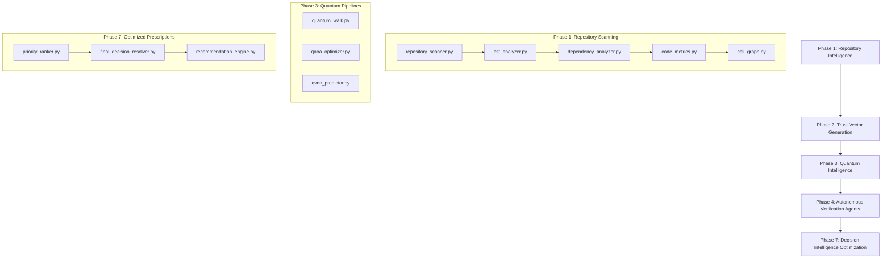

# QUEST System Architecture

This document describes the architectural layout, pipeline execution, and component responsibilities of the **QUEST (Quantum-assisted Unified Evaluation and Scheduling Tool)** framework.

---

## 1. Pipeline Execution Flow

QUEST is structured as a 7-phase data processing pipeline. Repository code is parsed, converted into a dependency graph, modeled via quantum walking and optimization, audited by verification agents, and prioritized through an adaptive decision intelligence resolver.

---

## 2. Phase Specifications

### Phase 1: Repository Intelligence
* **Modules**: [repository_scanner.py](file:///Users/abhiramdurbhakula/PythonProjects/QUEST/quest/retrieval/repository_scanner.py), [ast_analyzer.py](file:///Users/abhiramdurbhakula/PythonProjects/QUEST/quest/retrieval/ast_analyzer.py), [dependency_analyzer.py](file:///Users/abhiramdurbhakula/PythonProjects/QUEST/quest/retrieval/dependency_analyzer.py), [code_metrics.py](file:///Users/abhiramdurbhakula/PythonProjects/QUEST/quest/retrieval/code_metrics.py), [call_graph.py](file:///Users/abhiramdurbhakula/PythonProjects/QUEST/quest/retrieval/call_graph.py).
* **Role**: Parses source files, extracts function/class structures, maps import graphs, and computes McCabe complexity and Lines of Code (LOC).

### Phase 2: Trust Vector Generation
* **Modules**: [trust_vector.py](file:///Users/abhiramdurbhakula/PythonProjects/QUEST/quest/trust/trust_vector.py).
* **Role**: Encodes raw metrics (complexity, coupling, and security profiles) into normalized trust vectors representing local component health.

### Phase 3: Quantum Intelligence
* **Modules**: [quantum_walk.py](file:///Users/abhiramdurbhakula/PythonProjects/QUEST/quest/quantum/quantum_walk.py), [qaoa_optimizer.py](file:///Users/abhiramdurbhakula/PythonProjects/QUEST/quest/quantum/qaoa_optimizer.py), [qvnn_predictor.py](file:///Users/abhiramdurbhakula/PythonProjects/QUEST/quest/quantum/qvnn_predictor.py).
* **Role**: Simulates continuous-time quantum walks to model risk propagation, solves verification schedule constraints via QAOA, and runs variational quantum neural networks (QVNN) to predict local stability.

### Phase 4: Autonomous Verification Agents
* **Modules**: [agent_orchestrator.py](file:///Users/abhiramdurbhakula/PythonProjects/QUEST/quest/agents/agent_orchestrator.py).
* **Role**: Deploys localized verification specialist agents (Reviewer, Critic, Security, and Quantum) to run static audits and register priority severities.

### Phase 7: Decision Intelligence Optimization
* **Modules**: [decision_engine.py](file:///Users/abhiramdurbhakula/PythonProjects/QUEST/quest/decision/decision_engine.py), [priority_ranker.py](file:///Users/abhiramdurbhakula/PythonProjects/QUEST/quest/decision/priority_ranker.py), [final_decision_resolver.py](file:///Users/abhiramdurbhakula/PythonProjects/QUEST/quest/decision/final_decision_resolver.py), [recommendation_engine.py](file:///Users/abhiramdurbhakula/PythonProjects/QUEST/quest/decision/recommendation_engine.py).
* **Role**: Aggregates multi-source evidence, applies context-aware adaptive weighting, runs Schrödinger perturbation trials to calculate consistency, validates agent consensus, checks historical memory, and generates ROI-ordered remediations.

---

## 3. Core Directory Layout

* `quest/`: Codebase modules.
  * `retrieval/`: Phase 1 scanner and assistant retrieval tools.
  * `trust/`: Phase 2 trust vector logic.
  * `quantum/`: Phase 3 CTQW, QAOA, and QVNN implementations.
  * `agents/`: Phase 4 verification agents.
  * `decision/`: Phase 7 priority ranking and decision optimization resolver.
* `configs/`: Pipeline settings and base thresholds.
* `outputs/`: Output reports, weights, and results generated by pipeline execution.
* `tests/`: Complete unit and regression test suite.
